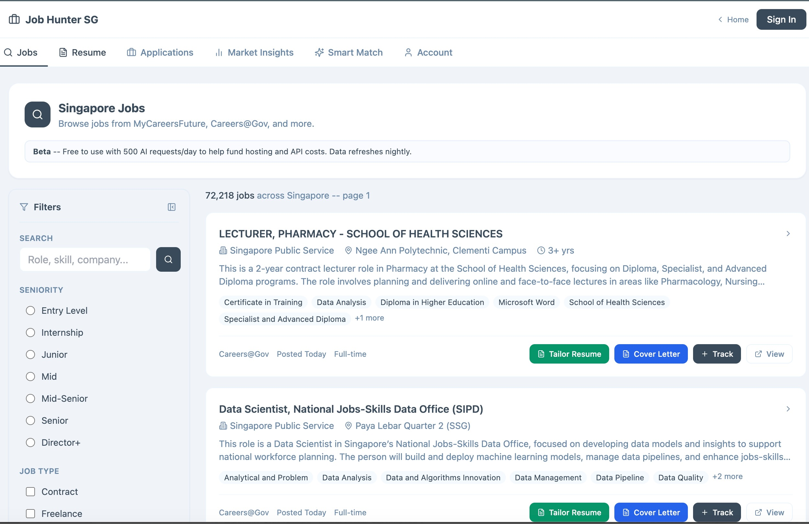
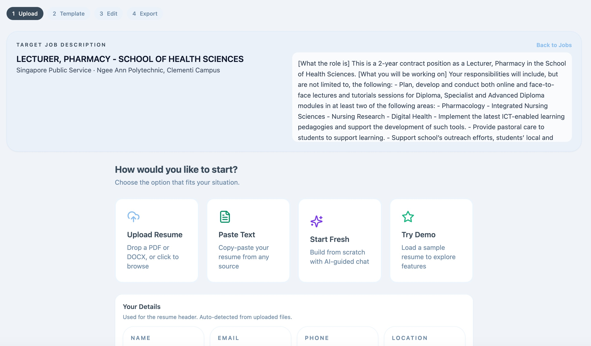
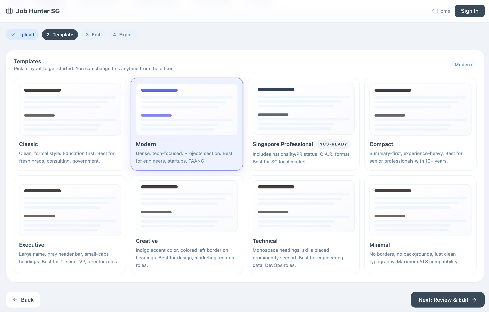
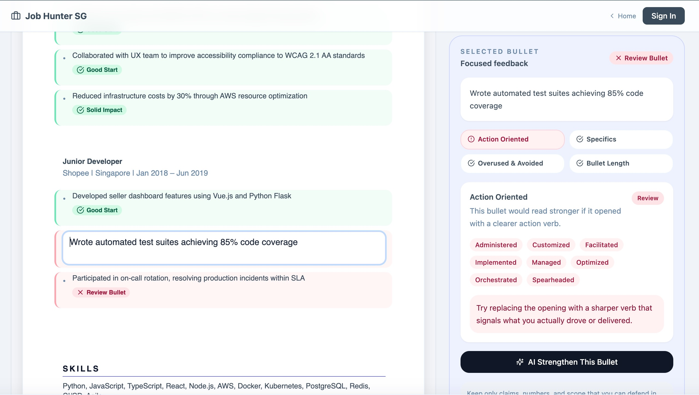
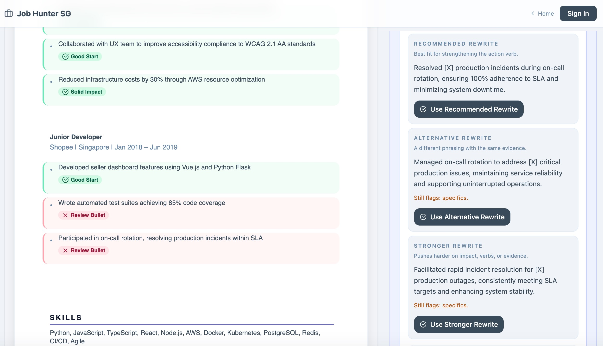
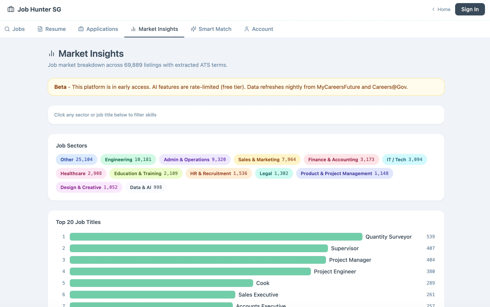
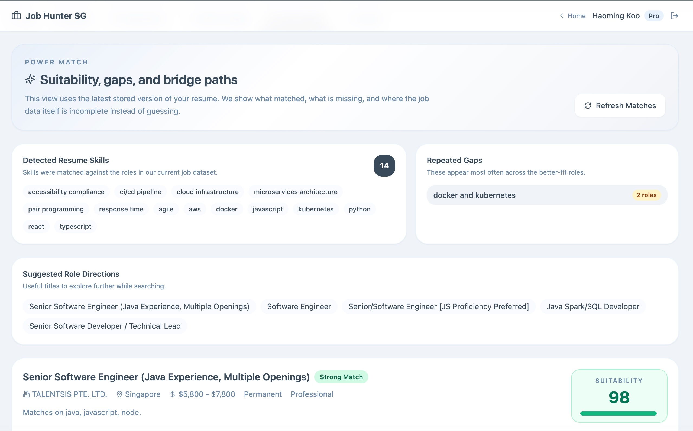
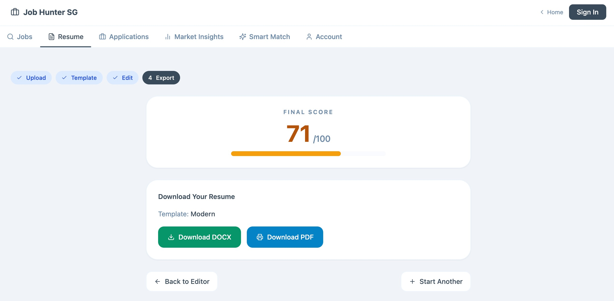

# Job Hunter SG

AI-powered job aggregator, resume coach, and career toolkit for the Singapore job market.

Searches MyCareersFuture and Careers@Gov in one interface. Scores your resume, rewrites bullets with validation gates to prevent hallucination, and generates tailored cover letters. Semantic matching via RAG finds jobs keyword search would miss.

**[Try it live](https://job.kooexperience.com)** | **[Blog Post](https://kooexperience.com/blog/posts/job-hunter.html)** | **[Portfolio](https://kooexperience.com)**


See [CHANGELOG.md](CHANGELOG.md) for recent enhancements and fixes.
Maintainers should start with the authoritative [maintainer handbook](docs/README.md).

## Screenshots

| | |
|---|---|
|  |  |
| **Job Search** — MCF + Careers@Gov with filters | **Upload** — PDF, paste, AI chat, or demo |
|  |  |
| **Templates** — 8 professional styles | **AI Feedback** — per-bullet coaching |
|  |  |
| **AI Rewrite** — 3 options per bullet | **Market Insights** — sector & skill trends |
|  |  |
| **Smart Match** — RAG-powered job matching | **Export** — DOCX with final score |

---

## Search Visibility

- Public app URL: <https://job.kooexperience.com/>
- `robots.txt` allows search engines plus OpenAI search crawlers for the public app while blocking `/api/` and `/api/admin/`.
- `sitemap.xml` lists the canonical app URL.
- `llms.txt` gives AI assistants a concise machine-readable project summary.
- `index.html` includes canonical, Open Graph, Twitter Card, WebApplication JSON-LD, and FAQ JSON-LD metadata.

After deployment, submit the site to Google Search Console and Bing Webmaster Tools, then confirm `https://job.kooexperience.com/robots.txt`, `/sitemap.xml`, and `/llms.txt` are publicly reachable.

---

## Features

### Job Search
- Aggregates MyCareersFuture and Careers@Gov; current source counts and freshness are shown in the dashboard — CareersGov data via [OpenGovSG](https://github.com/opengovsg/careersgovsg-jobs-data) (credit: Alwyn Tan @ OGP)
- Production source integrations should use official APIs, public employer feeds, or documented ATS job-board endpoints; browser automation is kept out of the hosted crawler unless explicitly reviewed for legal, privacy, and reliability risk
- Nightly crawl via Railway cron (22:00 UTC) for MyCareersFuture and Careers@Gov; Adzuna and Jooble are optional API integrations
- Filter by seniority, job type, salary range, skills
- ATS skill tags extracted at scrape time using the maintained [`skill_extractor`](backend/skill_extractor.py) taxonomy
- Source-aware dedupe uses official posting IDs or canonical source URLs, so repeated keyword hits collapse without merging distinct postings from the same employer
- Precomputed sector, salary floor, official SSIC fields, and skill-search fields keep filters fast without loading full job tables

### Resume Builder
- Upload PDF/DOCX or build from scratch with AI chat
- 8 professional templates (Classic, Modern, SG Professional, Compact, Executive, Creative, Technical, Minimal)
- Inline click-to-edit with drag-and-drop bullet reordering (Framer Motion)
- Add/delete sections, entries, bullets with one click
- Download as DOCX via python-docx

### AI Resume Coach (SEA-LION)
- ATS scoring (0-100) across Impact, Presentation, Competencies
- Per-bullet feedback with annotations (Solid Impact, Review, Verb Check)
- AI rewrite with 3 validated options per bullet
- 7-stage tailoring pipeline for specific JDs; active model tiers and budgets are configured in [`backend/config.py`](backend/config.py)
- Deterministic [`validation gates`](backend/validation_gates.py) check fact preservation, AI phrasing, keywords, length, and hallucination risk on every rewrite
- Injectable vs non-injectable keyword classification — AI can only add skills the user plausibly has
- Custom summary generation with user prompts

### AI Resume Chat Builder
- Conversational interface that builds your resume from scratch
- Coaches you to add metrics and quantified achievements
- Generates structured resume dropped directly into the editor

### Cover Letter Generator
- Generate from resume + job description
- Custom direction ("emphasize leadership", "keep it concise")
- Edit inline, copy, or download

### Smart Match (RAG)
- Semantic job matching using sentence-transformers/all-MiniLM-L6-v2 (384-dim)
- Hybrid scoring: keyword overlap + cosine similarity
- Suitability scores, skill gap analysis, bridge paths
- Shows the exact stored resume snapshot used for matching so results are auditable
- Pre-embedded jobs for instant matching
- Persisted match snapshots return repeat visits instantly when resume and job corpus are unchanged
- "Close the Gap" course recommendations map repeated missing skills to official MySkillsFuture courses, ranked by relevance, rating, career impact, and response count

### Market Insights
- Industry/sector, title, company, salary, freshness, and seniority breakdowns across the cached job corpus
- Official company industry uses ACRA corporate entity data from data.gov.sg when an employer maps to SSIC; otherwise the app keeps the sector explicitly labelled as inferred or unavailable
- Drill down by source, industry/sector, title, or company/department to inspect Careers@Gov, MyCareersFuture, civil-service demand, and hiring concentration
- Directional market movers compare last-30-day dated postings against older postings in the same slice; persisted daily snapshots are the next step for true trend charts
- Salary views show advertised floor plus midpoint when range data is available
- Sector inference uses precomputed title and extracted-skill signals only as the fallback when official ACRA/SSIC mapping is unavailable

### Application Tracker
- Track applications: Applied, Interview, Offer
- Follow-up reminders
- Status tracking per job

### Interview Story Bank
- Generates STAR+R interview story drafts from resume evidence with review-before-save flow
- Manual Big Three prompts cover elevator pitch, impact project, and conflict resolution
- Long-running story extraction shows live progress feedback so users know it is still working

---

## Tech Stack

| Layer | Technology |
|-------|-----------|
| Backend | FastAPI + SQLAlchemy + SQLite/PostgreSQL |
| Frontend | React 18 + Vite + Tailwind CSS + Framer Motion |
| AI | SEA-LION (AI Singapore), with model tiers configured in [`backend/config.py`](backend/config.py) |
| Embeddings | sentence-transformers/all-MiniLM-L6-v2 |
| Skills | SSG-WSG Skills Framework + data.gov.sg MySkillsFuture Course Directory |
| Rate Limiting | Provider and per-account limits configured through [`backend/config.py`](backend/config.py) and environment variables |
| Auth | Verified email/password accounts (JWT + bcrypt), optional Cloudflare Access, per-account throttling |
| Deploy | Railway (Docker), persistent PostgreSQL |
| Quality | GitHub Actions, Ruff, Gitleaks, Dependabot, pre-commit hooks |

---

## Quick Start

The authoritative fresh-clone instructions, prerequisites, and environment
boundaries are in [docs/getting-started.md](docs/getting-started.md). The short
development loop is:

```bash
# Backend
python3.12 -m venv .venv
.venv/bin/python -m pip install -r backend/requirements.txt
.venv/bin/python backend/main.py  # starts on :8000

# Frontend
cd frontend
npm ci --legacy-peer-deps
npm run dev     # starts on :5173, proxies /api to :8000
```

---

## Testing

```bash
# Fast backend quality checks
python -m compileall -q backend
ruff check backend tests

# Frontend production build
cd frontend && npm run build

# Full test suites
PYTHONPATH=backend python -m pytest backend/tests tests -q
cd frontend && npm test
```

Local pre-commit hooks are intentionally lightweight and CI is the merge gate:

```bash
pip install pre-commit
pre-commit install
```

---

## Architecture

See [docs/architecture.md](docs/architecture.md) for the maintained end-to-end
flow and trust boundaries. This compact map is only an orientation:

```
configured sources → sanitize/precompute → scraped_jobs → API ↔ React
resume upload → isolated parser → canonical browser document
saved resume versions → scoring / Power Match / Documents
classic tailoring or accepted recruitment edits → new derived resume version
tracked_jobs.role_metadata → latest application cover letters → Documents
```

---

## API Highlights

60+ endpoints total. Key ones:

| Endpoint | Description |
|----------|-------------|
| `GET /api/jobs` | Browse cached jobs with filters |
| `POST /api/search?q=...` | Admin live-source job search |
| `POST /api/resume/score` | Score resume 0-100 |
| `POST /api/resume/upload` | Upload PDF/DOCX, extract text |
| `POST /api/resume/tailor` | Start 7-stage tailoring pipeline |
| `GET /api/resume/tailor/{id}/status` | Poll pipeline progress |
| `POST /api/ai/rewrite` | AI bullet rewrite (3 options) |
| `POST /api/ai/cover-letter` | Generate cover letter |
| `POST /api/ai/resume-chat` | Conversational resume builder |
| `POST /api/jobs/power-match` | Smart Match with RAG |
| `POST /api/skillsfuture/recommend` | MySkillsFuture courses for Smart Match gaps |
| `POST /api/admin/seed` | Trigger job crawl (admin) |

---

## Environment Variables

```bash
# Omit DATABASE_URL locally to use backend/jobhunter.db.
# Set an explicit PostgreSQL URL on hosted deployments.
JWT_SECRET=your-secret
AUTH_MODE=password
ACCOUNT_AI_PER_DAY=500
SEALION_API_KEYS=your-key,another-key # canonical comma-separated key pool
ALLOWED_EMAIL_DOMAINS=*               # or comma-separated domains
ALLOWED_ORIGINS=http://localhost:5173  # CORS

# ACRA SSIC company taxonomy
# Default: local backend/data/company_ssic_cache.json only; no live lookup on user requests.
# Local backfill:
#   cd backend && python backfill_company_ssic.py --limit 200 --live --delay 8
# Railway production backfill:
#   railway ssh python backfill_company_ssic.py --limit 200 --live --delay 8
# Do not use `railway run` for this; it runs locally and Railway's private
# postgres.railway.internal hostname will not resolve from your laptop.
# COMPANY_SSIC_CACHE_PATH=/absolute/path/company_ssic_cache.json
ACRA_LIVE_LOOKUP=0
```

See `.env.example` for the maintained operational reference and
`backend/config.py` for lower-level tuning defaults.

---

## License

[AGPL-3.0](LICENSE) — Free to use and modify. Must share changes if deployed as a service. Attribution required.

Built by [Haoming Koo](https://kooexperience.com).
