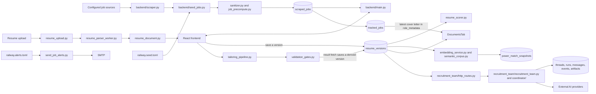

# Architecture and Trust Boundaries

Job Hunter SG is a FastAPI application and React single-page app backed by
SQLAlchemy. Production uses one Railway web replica with PostgreSQL plus two
scheduled services. Local development defaults to SQLite.

## System flow

## Main paths

### Jobs

`backend/scraper.py` defines the implemented source adapters. The full scheduled
crawl in `backend/seed_jobs.py` fetches MyCareersFuture and Careers@Gov, rejects
unhealthy/incomplete crawls before stale-row retirement, sanitizes source data,
precomputes filter fields, and upserts `ScrapedJob` rows. `backend/main.py`
serves the persisted corpus; `frontend/src/components/ScraperTab.jsx` browses
it. Optional live admin search uses the same `JobAggregator` but is not evidence
that a source is in the nightly crawl.

### Resumes, scoring, matching, and tailoring

Uploads enter through the bounded `resume_upload.py` boundary and are parsed in an isolated worker before
`resume_document.py` creates the canonical document. Saving or importing from
the browser creates a user-owned `ResumeVersion`; parsing alone does not create
one. `resume_scorer.py` calculates resume quality scores.
Power Match combines the stored resume and job corpus through
`embedding_service.py`/`semantic_corpus.py`; repeatable results are cached in
`PowerMatchSnapshot` by user, resume hash, corpus marker, and limit.

Classic tailoring runs through an in-process `tailoring_pipeline.py` session.
`resume_structurer.py` structures that input and `validation_gates.py` checks
rewrites. Fetching a completed result saves a new derived `ResumeVersion`; it
does not overwrite the source version and does not wait for a separate accept
action. Recruitment-team proposed edits use a different flow: only an explicit
accept creates their new resume version.

The Documents view combines active `ResumeVersion` rows with the latest cover
letter for each tracked application. Cover letters are stored under
`TrackedJob.role_metadata["cover_letter"]`, with job identity and resume
provenance checked by `application_workspace.py`; there is no separate document
service or blob store.

### Recruitment runs

`frontend/src/components/RecruitmentTeamPanel.jsx` calls the routes in
`backend/recruitment_team/http_routes.py`. The recruitment module coordinates
candidate profiling, job discovery, specialist work, synthesis, and proposed
edits. Threads, commands, visible messages, ordered activity, candidate-profile
artifacts, target assessments, and proposed edits have durable SQLAlchemy
models. Specialist work completed before a candidate-question pause is retained
only as internal resume state; the candidate-facing assessment API and UI expose
specialist findings and synthesis only after the independent judge completes.
Some concurrency controls, caches, and active execution remain
in-process, which is why production is intentionally one web replica and one
Python worker.

The open-agent runner uses LangGraph's PostgreSQL checkpointer whenever
`DATABASE_URL` is PostgreSQL, so candidate-question pauses survive container
replacement and can resume on another worker. Local SQLite uses
`OPEN_AGENT_CHECKPOINT_DB_PATH` (default `open_agent_checkpoints.db`).

### Deployment and scheduled work

The root `Dockerfile` builds Vite assets, copies them into FastAPI's `static`
directory, installs the Python application, and runs `backend/main.py` as one
container. `railway.toml` checks `/api/health`. `railway.seed.toml` runs the full
crawl at 22:00 UTC. `railway.alerts.toml` runs opt-in alert delivery at 23:00
UTC with the smaller alerts image.

## Trust boundaries

| Boundary | Rule and enforcement point |
|---|---|
| Browser to API | Treat resume text, job text, filenames, and form fields as untrusted. FastAPI schemas, size limits, `sanitizer.py`, authentication, ownership filters, and rate limits enforce the boundary. |
| Public, account, admin | Job browsing and health are public; resume/RAG/recruitment data is account-owned; live refresh and operational metrics require the admin role. Do not infer authorization from a hidden frontend control. |
| Job sources to database | Source payloads are untrusted external data. Sanitize and normalize before persistence. A successful HTTP response is not a healthy crawl; retirement requires the existing completeness checks. |
| API to AI provider | Prompts can contain hostile job descriptions or resume text. `prompt_safety.py`, structured contracts, bounded retries, and validation gates constrain output. Never send credentials or unrelated user records. |
| AI output to user record | Model output is not automatically factual. Validation and explicit accept/reject flows protect candidate claims and resume edits. |
| User to user | Every user-owned query must include the authenticated owner ID. Foreign keys alone do not enforce tenant isolation. |
| Process to persistence | PostgreSQL stores production records and LangGraph checkpoints; local SQLite is durable only on its host. Module caches, rate limits, active jobs, and some locks remain process-local and must not be presented as cross-replica controls. |
| Secrets | Secrets are server-side environment variables. They must not enter logs, browser bundles, docs, fixtures, screenshots, or issue comments. `VITE_*` values are public at build time. |
| Optional MCP | The external MCP surface is disabled without `MCP_API_KEY` and has its own request limit. It is not a privileged bypass around API ownership rules. |

## Sources of truth

- Data schema: `backend/models.py`
- Runtime configuration: `backend/config.py`, `.env.example`
- API composition: `backend/main.py`, `backend/recruitment_team/http_routes.py`
- Account-owned libraries: `backend/job_alert_preferences.py`,
  `backend/resume_versions.py`, `backend/story_bank.py`, and their thin route modules
- Target-assessment execution: `backend/recruitment_team/open_agent/runner.py`,
  `quality_gate.py`, and `checkpoint_store.py`
- Source availability: `backend/scraper.py`, `backend/seed_jobs.py`, and the
  [source matrix](sources.md)
- Deployment topology and schedules: `railway*.toml`, `Dockerfile*`
- Automated checks: `.github/workflows/ci.yml`

Design documents under `docs/` explain intent but do not override these files.
